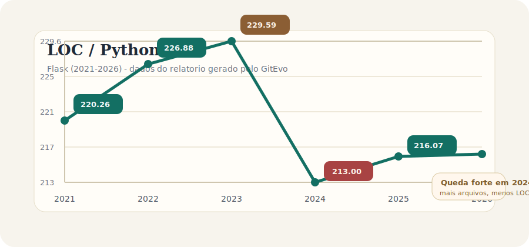

# Explorando evolução de código

Neste exercício, iremos explorar a evolução de código em sistemas reais.

Iremos utilizar a ferramenta [GitEvo](https://github.com/andrehora/gitevo).
Essa ferramenta analisa a evolução de código em repositórios Git nas linguagens Python, JavaScript, TypeScript e Java, e gera relatórios `HTML` como [este](https://andrehora.github.io/gitevo-examples/python/pandas.html).

Mais exemplos de relatórios podem ser podem ser encontrados em https://github.com/andrehora/gitevo-examples.

# Passo 1: Selecionar repositório a ser analisado

Selecione um repositório relevante na linguagem de sua preferência (Python, JavaScript, TypeScript ou Java).
Você pode encontrar projetos interessantes nos links abaixo:

- Python: https://github.com/topics/python?l=python
- JavaScript: https://github.com/topics/javascript?l=javascript
- TypeScript: https://github.com/topics/typescript?l=typescript
- Java: https://github.com/topics/java?l=java

# Passo 2: Instalar e rodar a ferramenta GitEvo

> [!NOTE]
> Antes de instalar a ferramenta, é recomendado criar e ativar um [ambiente virtual Python](https://packaging.python.org/en/latest/guides/installing-using-pip-and-virtual-environments/#create-and-use-virtual-environments).

Instale a ferramenta [GitEvo](https://github.com/andrehora/gitevo) com o comando:

```
$ pip install gitevo
```

Execute a ferramenta no repositório selecionado utilizando o comando abaixo (ajuste conforme a linguagem do repositório).
Substitua `<git_url>` pela URL do repositório que será analisado:

```shell
# Python
$ gitevo -r python <git_url>

# JavaScript
$ gitevo -r javascript <git_url>

# TypeScript
$ gitevo -r typescript <git_url>

# Java
$ gitevo -r java <git_url>
```

Por exemplo, para analisar o projeto Flask escrito em Python:

```
$ gitevo -r python https://github.com/pallets/flask
```

> [!NOTE]
> Essa etapa pode demorar alguns minutos pois o projeto será clonado e analisado localmente.

# Passo 3: Explorar o relatório de evolução de código

Após executar a ferramenta [GitEvo](https://github.com/andrehora/gitevo), é gerado um relatório `HTML` contendo diversos gráficos sobre a evolução do código.

Abra o relatório `HTML` e observe com atenção os gráficos.

# Passo 4: Explicar um gráfico de evolução de código

Selecione um dos gráficos de evolução e explique-o com suas palavras.
Por exemplo, você pode:

- Detalhar a evolução ao longo do tempo
- Detalhar se as curvas estão de acordo com boas práticas
- Explicar grandes alterações nas curvas
- Explorar a documentação do repositório em busca de explicações para grandes alterações
- etc.

Seja criativo!

# Instruções para o exercício

1. Crie um `fork` deste repositório (mais informações sobre forks [aqui](https://docs.github.com/pt/pull-requests/collaborating-with-pull-requests/working-with-forks/fork-a-repo)).
2. Adicione o relatório `HTML` no seu fork.
3. No Moodle, submeta apenas a URL do seu `fork`.

Responda às questões abaixo diretamente neste arquivo `README.md` do seu fork:

1. Repositório selecionado: https://github.com/pallets/flask
2. Gráfico selecionado:



3. Explicação: Escolhi o gráfico `LOC / Python files`, que representa o tamanho médio dos arquivos Python do Flask em cada ano analisado. Entre 2021 e 2023, a média sobe de `220,26` para `229,59` linhas por arquivo, o que sugere que boa parte do crescimento do sistema aconteceu dentro de módulos que já existiam. Em 2024, porém, a curva cai para `213,00`, enquanto o número de arquivos Python cresce de `79` para `82` e o LOC total cai de `18.138` para `17.466`. Isso indica um movimento de limpeza e modularização: em vez de continuar acumulando responsabilidade nos mesmos arquivos, o projeto passou a distribuir melhor o código. Essa leitura combina com o [changelog oficial do Flask](https://flask.palletsprojects.com/en/stable/changes/), especialmente as versões `2.3.0` (25/04/2023) e `3.0.0` (30/09/2023), que registram remoção de código depreciado e a reestruturação das classes `Flask` e `Blueprint` em bases Sans-IO. Em 2025 e 2026, a média volta a crescer levemente, mas permanece abaixo do pico de 2023, sugerindo estabilização depois da refatoração, sem retorno ao padrão anterior de arquivos maiores. Do ponto de vista de boas práticas, considero a curva saudável: o projeto continua evoluindo, mas o tamanho médio dos módulos diminui no momento em que a arquitetura é reorganizada.


